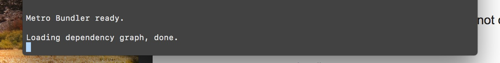
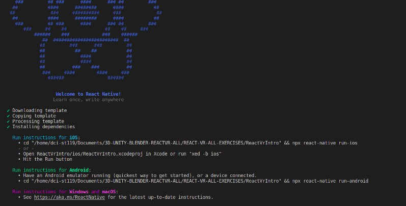
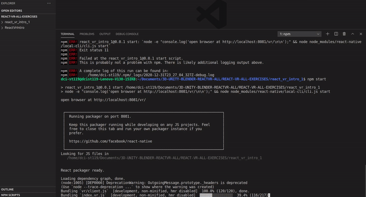

# REACT VR (introduction) 🦄

<br>

## SET UP (_first way_) ☁️

##### IF YOU HAVE ALL WHAT YOU NEED, the installation will be simple

- Node.js version 6.0.0 or higher
- yarn or npm (>= v3.0.0) package managers

##### Next, install the React VR CLI – a command-line tool that generates the basic layout of new projects.

```javascript
// 1
npm install -g react-vr-cli
// Or
yarn global add react-vr-cli
```

##### You'll only need to install this CLI once. It will alert you when it's out of date, and provide instruction on how to update it.

- Once installed, the CLI can be used to create a new project by running

```javascript
// 2
react-vr init PROJECT_NAME
//3
cd PROJECT_NAME
// 4
npm start
```

<br>

### 🐖 🏜️

[Getting Started with React VR](https://www.npmjs.com/package/react-vr)

<br>
<br>
<hr>
<br>

## ☁️ THE WAY I SET UP MINE ☁️

> I never tried React Native so it was a hell of ride for me

- IF I TRIED the set up (_first way_) i will be having this

[]()

- Its a never ending loading

##### Different solutions

[React-native get stuck at Dependency Graph](https://stackoverflow.com/questions/34406567/react-native-get-stuck-at-dependency-graph)

##### 🐖

[ npm starts hangs on 'Loading dependency graph, done](https://github.com/facebook/react-native/issues/16798)

##### 🦀

[ Loading dependency graph, done.](https://github.com/facebook/react-native/issues/25650)

<br>

#### Luckily I didnt need all that

- What i did was to create a folder called REACT-VR
- inside the folder "REACT-VR" i opened the terminal
- inside the terminal i typed

```javascript
npx react-native init react_vr_intro_1
```

- then after it loads, you should have something like this:

[]()

- after that, type the following:

```javascript
// 1
npm install -g react-vr-cli
// Or
yarn global add react-vr-cli
// 2
react-vr init PROJECT_NAME //(yours)
//3
cd PROJECT_NAME
// 4 grab the url and paste it on the browser
 http://localhost:8081/vr/
//
//  5 then type:
npm start
```

[]()

<br>

#### Important 🐖

- the errors you see in the image are related to another test i did before, so the new project launched the error clash with the server (due to two apps using it at the same time)

```javascript
 ERROR  Packager can't listen on port 8081
Most likely another process is already using this port
Run the following command to find out which process:

   lsof -i :8081

Then, you can either shut down the other process:

   kill -9 <PID>

or run packager on different port.
Loading dependency graph...npm ERR! code ELIFECYCLE
npm ERR! errno 11
npm ERR! react_vr_intro_1@0.0.1 start: `node -e "console.log('open browser at http://localhost:8081/vr/\n\n');" && node node_modules/react-native/local-cli/cli.js start`
npm ERR! Exit status 11
npm ERR!
npm ERR! Failed at the react_vr_intro_1@0.0.1 start script.
npm ERR! This is probably not a problem with npm. There is likely additional logging output above.
```

<br>

###### RESULT

[]()
